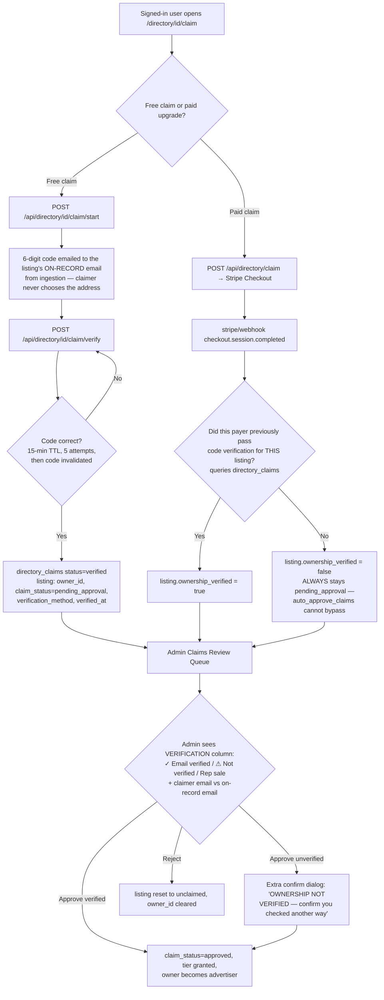

# Business-Listing Claim Verification (Anti-Fraud)

How CityBeat makes sure the person claiming a directory listing actually owns
the business — and what stops a scammer from taking over a real business's
listing.

## Threat model

The directory is seeded by automated ingestion, so listings exist **before**
their owners ever visit the site. The core risk: a stranger claims (or pays to
claim) a real business's listing, then controls its public contact info, deals,
and inbound leads — hijacking the business's identity for $19/mo.

Payment must therefore **never** count as proof of ownership.

## Flow

## Defenses in place

| Layer | Defense |
|---|---|
| Code delivery | Verification code goes **only to the listing's on-record email** (`resolveClaimVerification` ignores any claimer-supplied contact). Proving the code = proving control of the business's inbox. |
| Code guessing | 6-digit code, 15-minute TTL, **5 attempts** then the code is invalidated and must be re-requested. |
| Code spam | `claim/start` rate-limited: **3/hr per user+listing, 10/hr per user** — a caller can't flood a business's inbox with codes. |
| Paid ≠ owner | The Stripe webhook checks `directory_claims` for a **verified** claim by the payer for that exact listing and stamps `ownership_verified` on the listing. |
| Auto-approve | `auto_approve_claims` (godmode toggle, **ON since 2026-07-02**) only auto-approves claims that are **both paid and verified**. Unverified paid claims always wait for a human. |
| Double claim | `/api/directory/claim` returns 409 if the listing is `approved` **or** `pending_approval` under a different `owner_id` — a second payer can't clobber the first. |
| Admin review | The claims queue shows a per-claim badge — **✓ Email verified**, **⚠ Not verified**, or **Rep sale — attach owner** — plus the claimer's account email next to the business's on-record email so a reviewer can eyeball the match. Approving an unverified claim requires acknowledging an explicit warning. |
| Rep sales | Field sales (`sold_by_rep`) never auto-approve; an admin attaches the real owner using the captured `contact_email`. |
| Refunds | `charge.refunded` downgrades the listing's tier; subscription cancellation downgrades to basic. |

## What an admin should do with a ⚠ Not-verified claim

1. Compare the claimer's account email domain to the business's website/on-record
   email domain shown in the queue.
2. If they don't match, call the business's public phone number (shown in the
   Contact column) and confirm.
3. Only then approve — the confirm dialog exists to make this deliberate.

## Known gaps / future work

- **SMS and postcard verification are stubs** — the UI hides them and
  `claim/start` rejects them; only email verification delivers a code today.
  Postcard flow exists in the admin queue as a manual simulation.
- Listings **without an on-record email** can't be code-verified — those claims
  arrive as ⚠ Not verified and rely on the manual admin checklist above.
- No automated email-domain ↔ website-domain match scoring yet; the queue shows
  both values for the human to compare.
